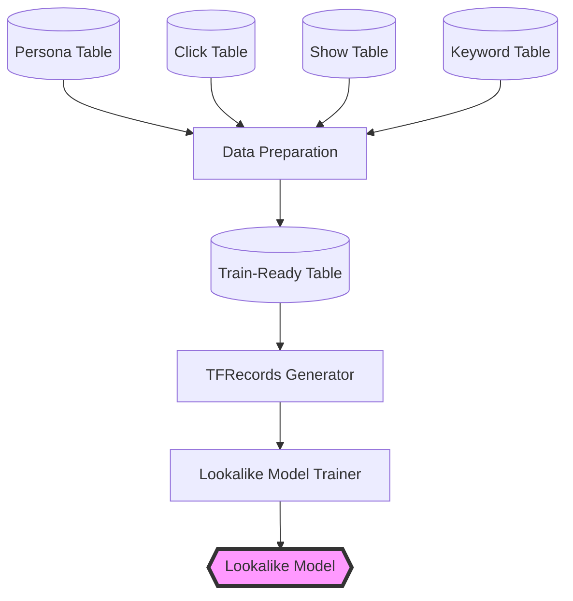
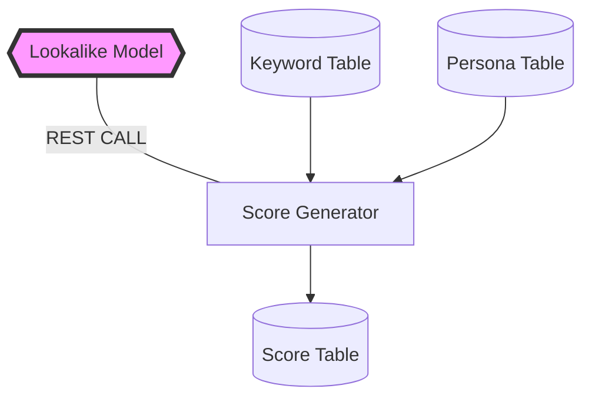
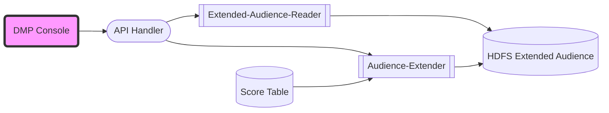
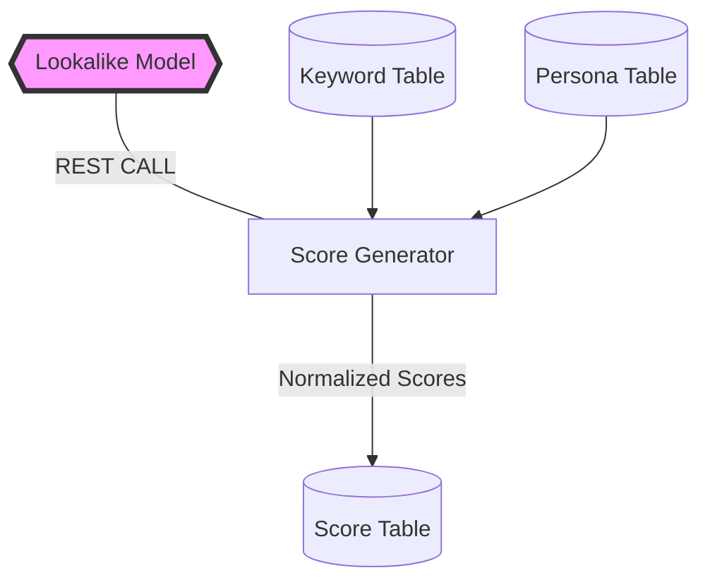
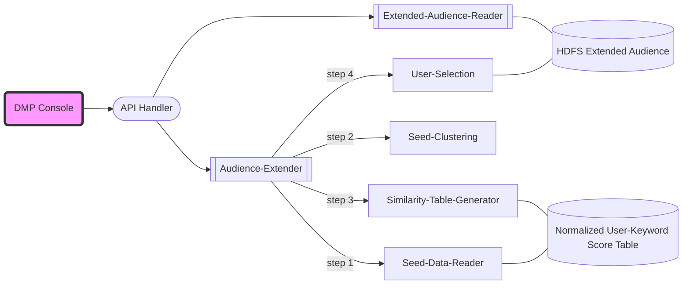
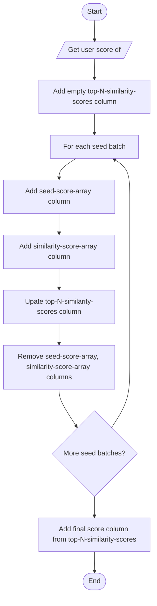
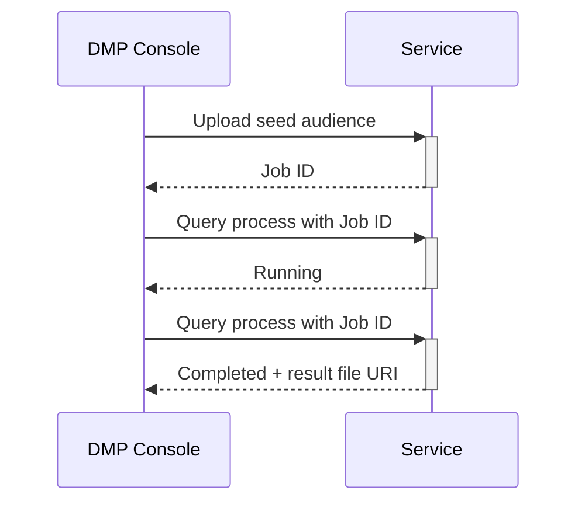

# Lookalike Model and Services


## Background

In Advertisement, lookalike models are used to build larger audiences from original audience (seeds). The larger audience reflects the characteristics of the seeds. This helps advertiser to reach a large number of new prospects.


## System Diagram


### Lookalike Data Preparation



### Lookalike Post Process



### Lookalike Services



## Data Preparation

### Overview

Data needs to be cleaned and transformed prior training. The data that is used for building a lookalike model has to posses the following characteristics:

+ User ID
+ User interests

The Lookalike model targets to setup the correlation between user and ads based on logged user behavior.  The log data got from product is usually noisy due to various reasons, such as: unstable slot_id, redundant records or missing data. The data pre-processing is then required to clean original logs data before the data can be feed into the model trainer. Cleaning steps include transforming the logs data to new data format, and generating new data tables. This document of the data frame transformations for logs data pre-processing is designed for clarifying the whole processing steps on logs data and guiding the coding logic on the data pre-processing of DIN model. 


### Input data

The input tables for Lookalike model are the following log files.

+ Persona table

```python
>>> df=sql('select * from ads_persona_0520')
>>> df.count()
380000
>>> t1=df.take(1)
>>> m=map(lambda x:(x[0],x[1],t1[0][x[0]]),df.dtypes)
>>> for _ in m:
...     print(_)
...
### USED Fields
('did', 'string', u'7eb9401a7ba0e377ad2fd81315b39da088b2943d69ff89c3ba56149d0a166d11')
('gender_new_dev', 'string', u'0')
('forecast_age_dev', 'string', u'3')
###
```

+ Show-Log table
```python
df=sql('select * from ads_showlog_0520')

### USED Fields
('did', 'string', u'fd939b9efd2d9c512bcd360c38d32eedf03f6a11a935295c817f8e61caa2f049')
('adv_id', 'string', u'40023087')
('adv_type', 'string', u'native')
('slot_id', 'string', u'l03493p0r3')
('spread_app_id', 'string', u'C10374976')
('device_name', 'string', u'MAR-AL00')
('net_type', 'string', u'4G')
('adv_bill_mode_cd', 'string', u'CPC')
('show_time', 'string', u'2020-01-07 16:22:18.129')
###
```

+ Click-Log table

```python
df=sql('select * from ads_clicklog_0520')

### USED Fields
('did', 'string', u'fd939b9efd2d9c512bcd360c38d32eedf03f6a11a935295c817f8e61caa2f049')
('adv_id', 'string', u'40023087')
('adv_type', 'string', u'native')
('slot_id', 'string', u'l03493p0r3')
('spread_app_id', 'string', u'C10374976')
('device_name', 'string', u'MAR-AL00')
('net_type', 'string', u'4G')
('adv_bill_mode_cd', 'string', u'CPC')
('click_time', 'string', u'2020-01-07 16:22:18.129')
###
```


### Clean Log Data

1. **Clean Persona Table**

	This operation is to clean persona table to:

	+ Have distinct did, gender and age.
	+ Have did associated to only one age and gender

2. **Clean Show-log and Click-log Tables**

	The cleaning operation is performed in batches.

	Every batch is cleaned according to following policies:

	+ Filter right slot-ids and add media-category
	+ Add gender and age from persona table to each record of log
	+ Add keyword to each row by using spread-app-id

```python
>>> sql('show partitions lookalike_02022021_limited_clicklog').show(100,False)
+---------------------------+
|partition                  |
+---------------------------+
|day=2019-12-19/did_bucket=0|
|day=2019-12-19/did_bucket=1|
|day=2019-12-20/did_bucket=0|
|day=2019-12-20/did_bucket=1|
+---------------------------+

>>> sql('show partitions lookalike_02022021_limited_showlog').show(100,False)
+---------------------------+
|partition                  |
+---------------------------+
|day=2019-12-19/did_bucket=0|
|day=2019-12-19/did_bucket=1|
|day=2019-12-20/did_bucket=0|
|day=2019-12-20/did_bucket=1|

>>> df=sql('select * from lookalike_02022021_limited_showlog')
>>> ...
>>> 
('spread_app_id', 'string', u'C10608')
('did', 'string', u'029d383c0cfd36dbe45ed42b2b784f06c04a6554b61c3919ea7b3681bc0fda39')
('adv_id', 'string', u'106559')
('media', 'string', u'native')
('slot_id', 'string', u'l2d4ec6csv')
('device_name', 'string', u'LIO-AN00')
('net_type', 'string', u'4G')
('price_model', 'string', u'CPC')
('action_time', 'string', u'2019-12-19 19:23:47.894')
('media_category', 'string', u'Huawei Reading')
('gender', 'int', 1)
('age', 'int', 4)
('keyword', 'string', u'info')
('keyword_index', 'int', 14)
('day', 'string', u'2019-12-19')
('did_bucket', 'string', u'1')
```


### Partitions

Log tables should be **partitioned by DAY and DID **.


### Log Unification

The log unification process is performed in batches. 

It processes data for each user partition separately and uses **load_logs_in_minutes** to load specific amount of log. 

Here is a pseudocode for the process.

```pseudocode
for each user-partition:
	start-time <- config
	finish-time <- config
	batch-size <- config
	while start-time > finish-time:
		batch-finish-time = start-time+batch-size
		read logs between start-time and batch-finish-time
		union logs
		save or append logs in partitioned tables ('day','user-did')
		start-time += batch-finish-time
```

Every batch of logs are unified according to following policies:

+ Add is_click=1 to click log
+ Add is_click=0 to show log
+ Union show and click logs
+ Add **interval_starting_time** 
	
	> This value shows the start_time of an interval. 
	>
	> For example for the following time series and for interval_time_in_seconds=5
	>
	> [100,101,102,103,104,105,106, 107,108,109]
	>
	> the interval_starting_time is
	>
	> [100,100,100,100,100,105,105,105,105,105]
	

Here is a sample of this stage output.

```python
>>> sql('show partitions lookalike_02022021_limited_logs').show(100,False)
+---------------------------+
|partition                  |
+---------------------------+
|day=2019-12-19/did_bucket=0|
|day=2019-12-19/did_bucket=1|
|day=2019-12-20/did_bucket=0|
|day=2019-12-20/did_bucket=1|
+---------------------------+

>>> df=sql('select * from lookalike_02022021_limited_logs')
>>> ...

('did', 'string', u'02842b445b7779b9b6cd86a7cde292f15cd10128a8a80f19bea7c310c49160df')
('is_click', 'int', 0)
('action_time', 'string', u'2019-12-19 13:04:14.708')
('keyword', 'string', u'video')
('keyword_index', 'int', 29)
('media', 'string', u'native')
('media_category', 'string', u'Huawei Video')
('net_type', 'string', u'WIFI')
('gender', 'int', 0)
('age', 'int', 5)
('adv_id', 'string', u'40014545')
('interval_starting_time', 'int', 1576713600)
('action_time_seconds', 'int', 1576789454)
('day', 'string', u'2019-12-19')
('did_bucket', 'string', u'0') 
```

### Build Train-Ready Data

TODO


## Model Training

The model trainer reads records from Tfrecords and train the model. The built model is saved in HDFS.


## Model Evaluation

The built model is compared against the previous model. If the new model performs better than the old model then it gets deployed and its name is stored in Zookeeper.


## Model Deployment

Here are the steps to deploy the model.

	1.	Pull a serving image : docker pull tensorflow/serving:latest-gpu
	2.	Put the saved model in .../lookalike/<date>/tfserving directory. 
	3.	Run the serving image: 

```bash
docker run -p 8501:8501 --mount type=bind,source=/tmp/tfserving,target=/models/<model_name> -e MODEL_NAME=<model_name> -t tensorflow/serving &
```


## Post Process

This part consists of one process "Score Table Generator". 


### Generate Score Table
This module uses Keyword Table, Persona Table and Lookalike Model to generate Score Table. The scores are **normalized**.

The score generator runs whenever a new lookalike model is generated.  The name of the score table is stored in Zookeeper to be used by API services.



The score table has the following schema. 

|| Keyword-Score|
|:-------------| :------------: |
|User-1| {kw1:norm-score-11, kw2:norm-score-12, kw3:norm-score-13} |
|User-2| {kw1:norm-score-21, kw2:norm-score-22, kw3:norm-score-23} |
|User-3| {kw1:norm-score-31, kw2:norm-score-32, kw3:norm-score-33} |


## API Services


### Abstract

This part describes the requirements, API, and high-level architecture for the Lookalike services.


### List of Abbreviations

| Acronym | Meaning           |
| ------- | ----------------- |
| ES      | Elasticsearch     |
| LS      | Lookalike Service |
| SG      | Score Generator   |
| ST      | Score Table       |


### Overview

The Lookalike Service is a real-time service whose purpose is to take an existing seed audience of users and return a group of additional users who have similar interests.  This provides an expanded audience to which advertisers can target their ad campaigns.  

Experienced advertisers will develop an understanding of the audience that they want to target with their campaigns.  This audience will be the users where the advertiser experiences the highest conversion rate for their metric of success.  However, this approach can exclude a large number of their potential audience that would be similarly receptive to their advertising campaign.  The Lookalike Service is intended to help advertisers expand the audience of their campaigns to users that are similar to their existing audiences that they would not otherwise know to target in their campaigns.

The Lookalike Service builds on the work done on the DIN model.  From the DIN model, a correlation can be developed between users and topic keywords by the Score Generator.  The Score Generator is an offline service that draws data from the DIN model and builds a score for each user for each of a given list of keywords.  The score is a numeric metric for the affinity of this user for the topic represented by the given keyword.  The scores for all users is stored in the Score Table.


##### System Entity Diagram



### Seed Data Reader

This module filters Score Table based on seeds and extracts keyword score for each seed user. 

It also builds a keyword reference list which corresponds to score list in the result dataframe.

The result dataframe has the following structure.


|| Keyword-Score|
|:-------------| :------------: |
|Seed-user-1| [norm-score-11, norm-score-12, norm-score-13] |
|Seed-user-2| [norm-score-21, norm-score-22, norm-score-23] |
|Seed-user-3| [norm-score-31, norm-score-32, norm-score-33] |


### Seed Clustering

This module is to cluster seeds. The output of this subsystem is a dataframe of seed-clusters and keyword scores. The number of the produced clusters shows how well the seeds share a same feature. If the number of the clusters ends up very high it means that the system is probably not able to extend seeds in a productive way.

|| Keyword-Score|
|:-------------| :------------: |
|Seed-cluster-1| [score-11, score-12, score-13] |
|Seed-cluster-2| [score-21, score-22, score-23] |
|Seed-cluster-3| [score-31, score-32, score-33] |


### Similarity Generator

This module produces user similarity dataframe.  The result dataframe has the following schema.

|| top-N-similarity-scores|final-score|
|:-------------| :------------: |
|user-1| [similarity-score-11, similarity-score-12, similarity-score-13] |final-score-1|
|user-2| [similarity-score-21, similarity-score-22, similarity-score-23] |final-score-2|
|user-3| [similarity-score-31, similarity-score-32, similarity-score-33] |final-score-3|


Similarity Generator has iterative process to produce top-N-similarity-scores. The following is the algorithm flow chart. 




### User Selector

This module selects the top M users in similarity dataframe and saves the result in HDFS. The result HDFS file carries the job-id in the path.


### APIs

Use of the Lookalike Service is a multi-step process due to the size of the potential audiences and the scale of processing involved in generating the lookalike audiences.  

Due to the scale of the computation required when generating the similarities between users (millions x 100millions), the processing of the Lookalike Service is divided into a REST endpoint to initiate the processing and a REST endpoint to poll the service on the completion of the processing.




#### Extend Audience API

```API
Method: POST
Signature: /lookalike/extend-audience
Input:
	Multipart list of seeds (user dids)
Output:
	Job reference ID
```
+ Sample output
```json
{
    "job-id":"3746AFBBF63"
}
```

##### Implementation

This is an asynchronous call that initiates the processing of a lookalike audience and returns with a generated UID that should be used to poll for the completion of the request. 

In the asynchronous process that is started: 

The base directory that uploads are stored is read from Zookeeper. A UID will be generated for each upload request.  The UID name will be used to create a subdirectory of the storage directory.  The files will be uploaded into the subdirectory.  The user IDs of the seed audience are loaded from the seed audience files.

The implementation is carried out by **Audience-Extender** service.

The top M most similar non-seed users to seeds are filtered and stored in HDFS file. M is loaded from Zookeeper.


##### Query Process Completion

```API
Method: GET
Signature: /lookalike/status/<job-id>
Input:
	Job-ID which is unique ID string for the Lookalike Service request.
Output:
	Status of the request. Possible responses can be Running and Finished. If job is Finished then the URI of result is presented.
```

+ Sample output
```json
{
    "statue":"Finished",
    "url": "../lookalike/extended-audience/<job-id>/exetened-audience-1p"
}
```

##### Implementation

This part is implemented by **Extended-Audience-Reader** service. This service checks HDFS for the URL of the extended audience. The service follows predefined template to construct url from job-id. If the url exits, it means job is finished and the module returns the url of the HDFS file.


##### Configuration

Configuration of the Lookalike Service will be stored in Zookeeper.  The configuration parameters are:

- Hive table name for score table
- Number of clusters to group existing audience
- Number of highest similarities to include in average
- Percentage of user extension, 